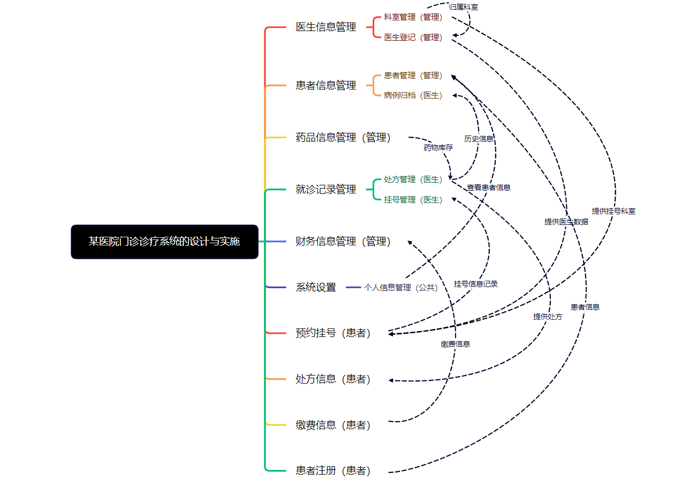
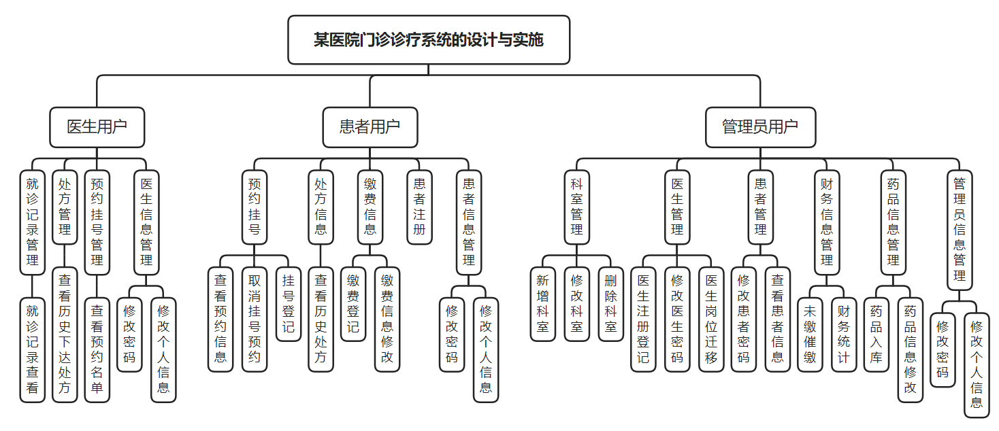

# 某医院门诊诊疗系统的设计与实施（react）

#### 介绍

某医院门诊诊疗系统的设计与实施

#### 软件架构

前端开发工具：vsCode

前端技术：React，TypeScript，vite，响应式开发，适配移动端

数据库：MySQL

服务端开发工具：IDEA

服务端技术：基于 Restful 的前后端分离 SSM 框架

服务器：Tomcat

运行环境：谷歌浏览器，火狐浏览器，edge 浏览器

#### 功能包括

（1）医生用户功能：

1、病例归档：医生对曾经面诊过的所有患者进行详细病情分析记录并进行归档管理与记录

2、处方管理：医生登录后可查看修改对患者下达的处方记录，以便追踪

3、预约挂号管理：医生可查看患者对自己的挂号记录信息

4、医生个人信息管理：医生登录后可在个人信息页面对其进行信息增加，删除，修改，更改密码等操作。

（2）患者功能
1、挂号功能：患者登陆后可根据科室对对应医生进行挂号预约的增加修改取消操作。

2、查看处方：患者在结束挂号并完成就诊后将收到医生开具的处方，可根据处方收取药物并进行缴费操作

3、缴费信息：患者在医生开具处方后需进行缴费，缴费记录可在此登记查看

4、患者注册：患者可在系统上注册自己的基本信息。注册完成后可在个人信息管理模块完善信息。

5、个人信息管理：患者可在系统登录后在个人信息页面对其进行信息增加，删除，修改，查看，更改密码等操作。

（3）管理员功能

1、科室管理：管理员通过科室管理增加修改对应科室信息，以便于后续分配登记医生至对应科室。

2、医生登记：管理员通过医生登记注册医生信息分配医生至对应科室并进行管理。

3、患者管理：管理员对已注册完成的患者信息进行对应管理维护操作，同时可以修改患者用户密码。

4、药品信息管理：管理员对库存药品进行增加修改删除等操作，以及进行对数据的维护

5、财务信息管理：管理员可统一管理患者缴费的财务信息，可对未完成缴费的用户进行催缴，避免财务损失

6、管理员信息管理：管理员可在系统上注册自己的基本信息，登录后可在个人信息页面对其进行信息增加，删除，修改，查看等操作。

数据库设计图

项目模块图

#### 项目图片

